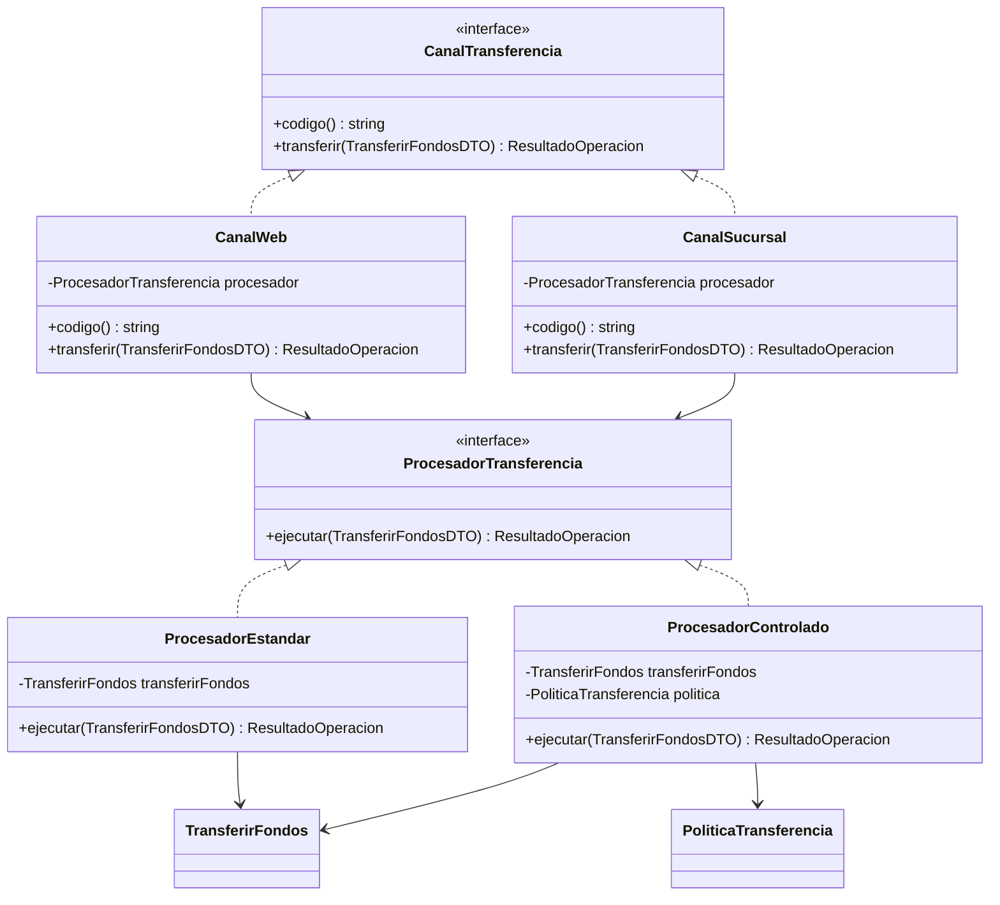
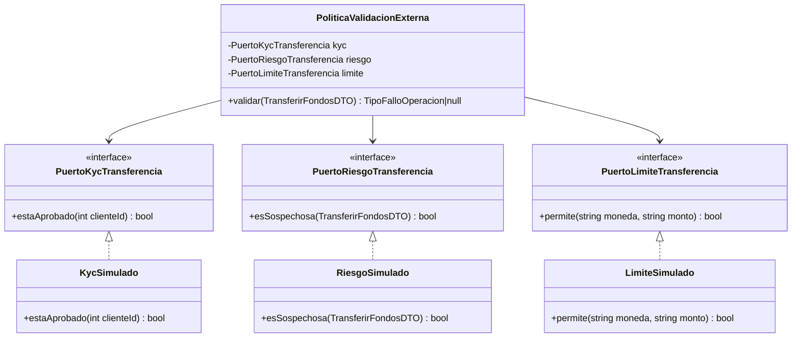
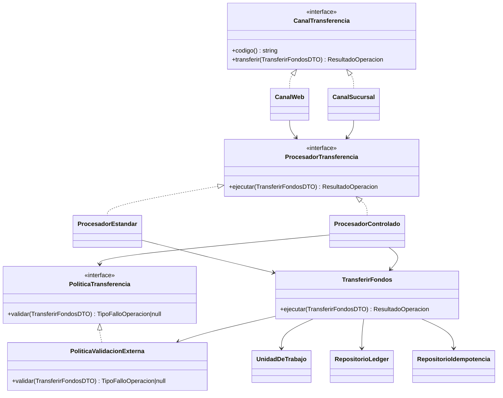
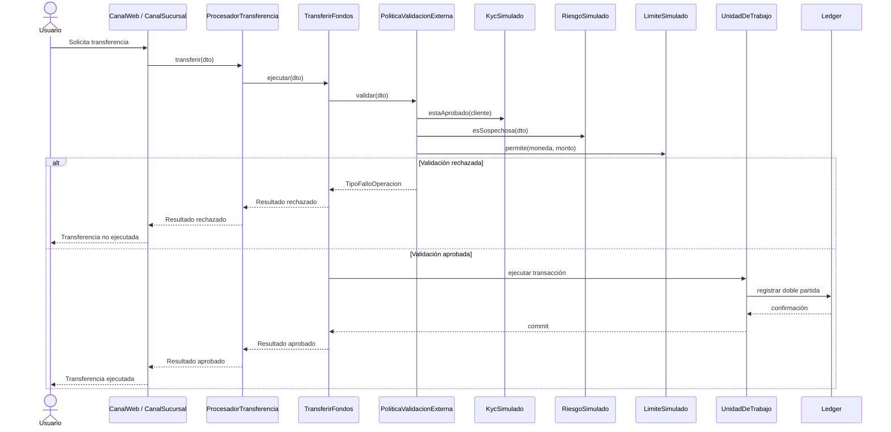

# Semana 7 — Adapter y Bridge con diagramas UML

## Propósito

Este documento complementa la entrega de la Semana 7 con diagramas UML para explicar cómo se aplicaron los patrones **Adapter** y **Bridge** en el flujo de transferencias bancarias multicanal.

## Resumen de la solución

La transferencia no se ejecuta directamente desde el canal. Primero pasa por una abstracción de canal, luego por un procesador de transferencia y finalmente reutiliza el caso de uso financiero existente.

```text
Canal
  → Procesador
  → TransferirFondos
  → Validaciones internas/externas
  → Unit of Work
  → Ledger
```

## Patrón Bridge

Bridge separa dos jerarquías que pueden variar de forma independiente:

| Dimensión | Clases |
|---|---|
| Canal de transferencia | `CanalWeb`, `CanalSucursal` |
| Procesador de transferencia | `ProcesadorEstandar`, `ProcesadorControlado` |

Esto evita crear una clase por cada combinación posible.

### Diagrama UML — Bridge



## Patrón Adapter

Adapter permite que el sistema use proveedores externos simulados sin acoplar el caso de uso financiero a una implementación concreta.

### Puertos internos

```text
PuertoKycTransferencia
PuertoRiesgoTransferencia
PuertoLimiteTransferencia
```

### Adaptadores simulados

```text
KycSimulado
RiesgoSimulado
LimiteSimulado
```

### Diagrama UML — Adapter



## Diagrama UML integrado



## Diagrama de secuencia



## Lectura académica

### Por qué Adapter

Adapter se justifica porque KYC, fraude y límites representan servicios externos o módulos independientes. El sistema define sus propios puertos y los adaptadores traducen las respuestas simuladas hacia el lenguaje interno de la aplicación.

### Por qué Bridge

Bridge se justifica porque el canal de origen y el procesador de transferencia son dimensiones independientes. Un canal web puede usar un procesador estándar o controlado; una sucursal también puede usar cualquiera de ellos sin crear una clase específica por combinación.

## Limitaciones

- Los adaptadores son simulados.
- No se integran proveedores reales de KYC, fraude o AML.
- No se agregó persistencia de auditoría para rechazos por canal.
- La evidencia de concurrencia MySQL/InnoDB de Semana 6 sigue pendiente.

## Conclusión

La solución demuestra cómo aplicar **Adapter** para desacoplar validadores externos simulados y **Bridge** para combinar canales y procesadores sin duplicar lógica financiera. El flujo mantiene la unidad de trabajo transaccional, ledger de doble partida e idempotencia como núcleo seguro de la operación bancaria.
